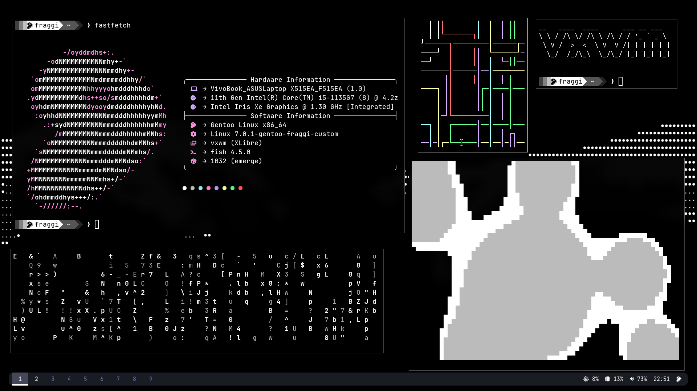
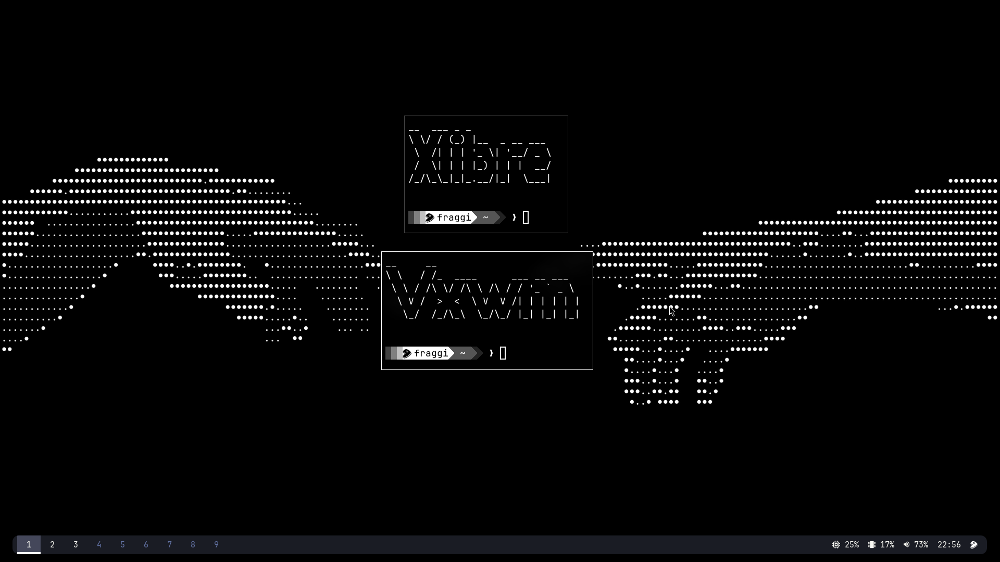
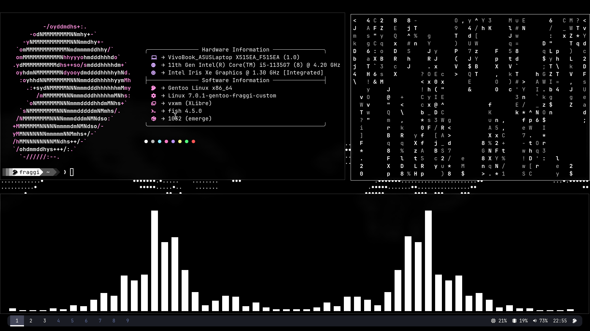
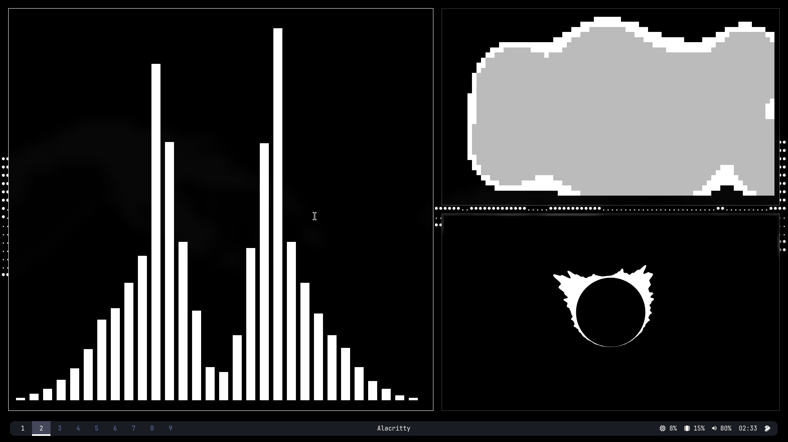

# My vxwm gentoo dotfiles
> Made originally for Gentoo

## Gallery

## Packages
Picom
Alacritty
Polybar

## How to set it up
Create the Folder where you'll have Vxwm:
~~~bash
mkdir -p ~/src && cd ~/src
git clone https://codeberg.org/wh1tepearl/vxwm.git
cd vxwm
~~~

Now you will have the default config files that are given to you, you can remove those and copy mine, don't forget to install the necessary drivers and to follow the guide on [Wh1tepearl codeberg](https://codeberg.org/wh1tepearl/vxwm), after you've copied the files do:
~~~bash
make && sudo make install
~~~

## Picom
I used a different version of picom to add more animations, since the official one only uses the fade anymation, install it:
~~~bash
cd ~/src
git clone https://github.com/FT-Labs/picom.git
cd picom
meson setup --buildtype=release build
ninja -C build
doas ninja -C build install
~~~

## Sddm setup (if you have sddm)
If you use sddm you know SDDM looks for .desktop files in /usr/share/xsessions/ but vxwm doesn't create one automatically, so you have to create it manually:
~~~bash
vim /usr/share/xsessions/vxwm.desktop
~~~
and paste this:
~~~bash
[Desktop Entry]
Name=vxwm
Comment=Versatile X Window Manager
Exec=/usr/local/bin/vxwm
Type=Application
DesktopNames=vxwm
~~~
Well done! now you can boot into it.
